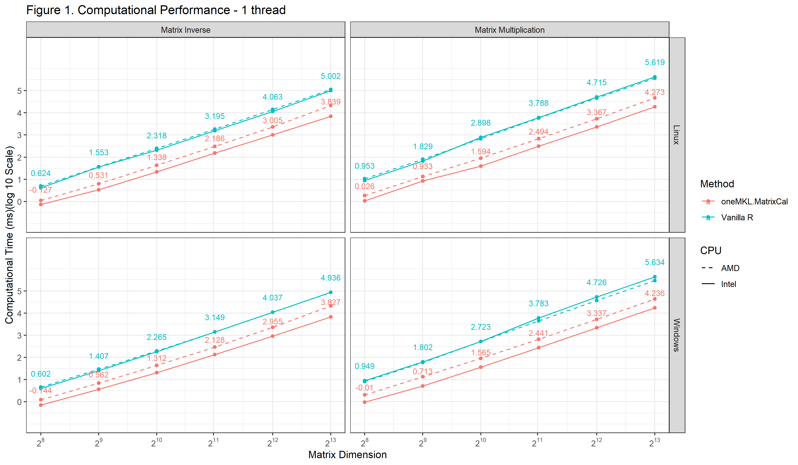
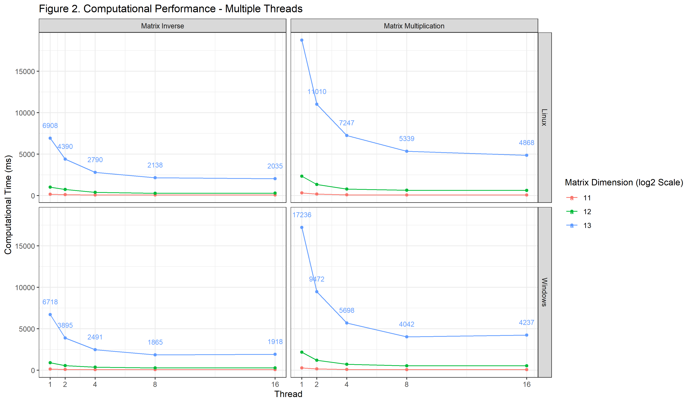

# Summary
Two packages were created to accelerate the large-scale matrix computations for R users [@R]. The first package, `oneMKL`, connects R with the Intel oneAPI Math Kernel Library (oneMKL). The second package, `oneMKL.MatrixCal`, provides `oneMKL`-based matrix operation functions in R, i.e., through the Rcpp header file for Intel oneMKL. Using these packages, users can perform multiple threads computations and leverage all sub-libraries included in oneMKL, such as Basic Linear Algebra Subprograms (BLAS) [@lawson1979basic], Linear Algebra Package (LAPACK) [@anderson1999lapack]. We assess the performance of `oneMKL.MatrixCal` by comparing it with vanilla R. Our results demonstrate that, for Windows systems equipped with an Intel CPU, the running time of our package to find an inverse of a $2^{13}\times2^{13}$ matrix was 12.85 times shorter than the "solve" function in vanilla R. Furthermore, the `oneMKL.MatrixCal` package supports parallel computing, enabling users to execute large-scale matrix computations efficiently and cost-effectively. The two packages are available at https://github.com/R-OneMKL/.

# Statement of need 
Comprehensive R Archive Network (CRAN) [@hornik2012comprehensive] is a widely used R version for statistical computing. However, its default implementation of LAPACK and BLAS, the reference Netlib, cannot perform multiple-thread computation work. This limits the efficiency and scalability of large-scale matrix computations. To address the issue, we first developed the `oneMKL` package, which enables CRAN R users to utilize optimized algorithms and parallel computing from Intel oneMKL, and access all sub-libraries included in oneMKL, such as BLAS, LAPACK, and VSL. The second R package, `oneMKL.MatrixCal`, is developed to accelerate large-scale matrix calculations in Windows and Linux operation systems via `oneMKL`. The `oneMKL.MatrixCal` package also provides the capabilities of performing multithreaded computations through Intel oneMKL. Overall, these packages are powerful tools for matrix computations, reducing the need for expensive computing resources or complex programming practices.

# Matrix operation functions with **`oneMKL.MatrixCal`** Package
The `oneMKL.MatrixCal` package provides users with a comprehensive suite of matrix operation functions. Specifically, the package offers a wide spectrum of matrix decomposition methods, such as Cholesky decomposition, LU decomposition, QR decomposition, singular value decomposition (SVD), and eigenvalue decomposition. In addition, the package includes the capabilities of performing basic matrix operations, such as addition, subtraction, multiplication, and matrix inversion. Users can also calculate the determinant, rank, row sum, and column sum of a matrix using this package.

# Performance of **`oneMKL.MatrixCal`**
A simulation study to assess the computational performance of `oneMKL.MatrixCal` package in comparison to vanilla R was conducted. The main focus was to evaluate the time cost of matrix multiplication and inverse matrix operations for $2^N \times 2^N$ matrices, where $N$ = 8, 9, 10, 11, 12, and 13. Our package utilizes the Intel oneMKL to perform all matrix operation functions. 

We also analyzed the package performance under different operating systems, Windows vs. Linux, and CPU types, Intel vs. AMD. Simulations were performed on two different computers that have distinct CPU types. The first had an AMD Ryzen Threadripper 2990WX CPU @ 3.6GHz, DDR4-2866 128GB memory, and a Plextor M8PeG 1TB disk. The second computer used an Intel Core i9-10900 CPU @ 2.80GHz, DDR4-2933 64GB memory, and a WD SN730 512GB disk.  

To satisfactorily measure the computational cost, we repeat the simulations 50 times for small-scale matrices (with dimensions $2^8$ and $2^9$) and 20 times for large-scale matrices. All entries of the matrices in each repeated simulation were assumed to follow a standard normal distribution. The final results reported are the mean running time, as shown in Fig. \ref{fig:onethread}. The left and right panels in the figure summarize the matrix inverse and multiplication results, respectively, for different operating systems and CPU types. The red and blue lines represent the performance of our package and vanilla R. The solid and dashed lines indicate that the simulation tasks were performed on Intel and AMD CPUs.

{ width=100% }

Several observations can be made from Fig. \ref{fig:onethread}. First, the computer with an Intel CPU consistently exhibits greater computational efficiency when compared to the one with an AMD CPU. For instance, in executing matrix multiplication on $2^{13}\times2^{13}$ matrices on the Windows system, the running time of our package was 25.00 (= $10^{5.634-4.236}$) and 6.65 (= $10^{5.463-4.640}$) times smaller than vanilla R, respectively using Intel and AMD CPUs. The better performance of Intel CPUs can be attributed to the infrastructure of our package, which provides low-level access to the instruction set used by Intel CPUs. In short, the `oneMKL.MatrixCal` package exhibits much better computational performance than vanilla R.

Second, our package considerably improves the computational performance for the inverse of large-scale matrices. For example, in computing the inverse of a matrix of dimension $2^{13}\times 2^{13}$, our package is 12.85 (= $10^{4.936-3.827}$) times faster than vanilla R for Windows systems with an Intel CPU. If the simulation is performed on Linux, the performance can be further improved, reaching 14.55 times shorter due to the efficient kernel design and fewer background processes in Linux. All of the calculations are performed in serial computing. Further improvement in computational performance can be achieved utilizing parallel computing capabilities, as also demonstrated in Fig. \ref{fig:multithread}.

{ width=100% }

In conclusion, `oneMKL.MatrixCal` provides a cost-effective and user-friendly solution for large-scale matrix computations. It is an essential tool for users who need to perform extensive computational tasks in R. The package connects R to Intel oneMKL to accelerate matrix operations, reducing computational time. This benefit is particularly noteworthy for Windows systems with Intel CPUs or computations that are performed in parallel. While limited to Windows and Linux systems, considering these two operating systems can represent the majority of users, this package can benefit the R community.  
